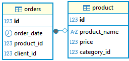

# 📈 Анализ продаж: Рейтинг Топ-3 и ABC-анализ

## 📊 О проекте
Анализ продаж магазина с использованием оконных функций.  

## 🗄️ Структура данных
Использую тестовую базу данных магазина, созданную специально для портфолио.
База максимально упрощенная, из двух таблиц:

*Предполагается, что каждый заказ содержит один товар.*

## 📁 Структура проекта

### Быстрая навигация
- [🔍SQL запросы](sql)
- [📊 Визуализация и аналитика](analysis.md)  

### Файлы
- [ER-диаграмма](ER.png)

- [Результат Топ-3](results/top_3.png)
- [Результат ABC-анализа](results/ABC.png)

- [Визуализация Топ-3](visualization/top_3.png)
- [Визуализация ABC-анализа](visualization/ABC.png)

## 🛠 Технологии
- **БД:** PostgreSQL
- **IDE:** DBeaver
- **Визуализация:** Power BI

---

[⬅️ Назад к общему портфолио](../README.md)