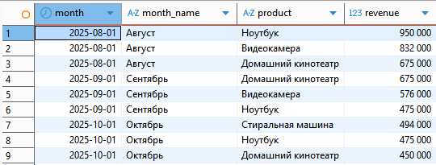
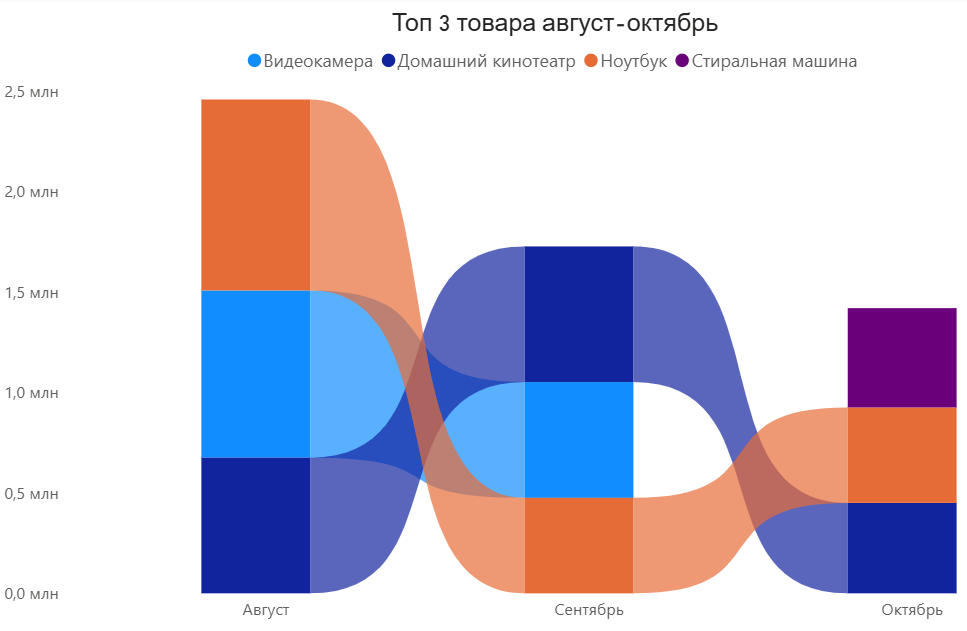
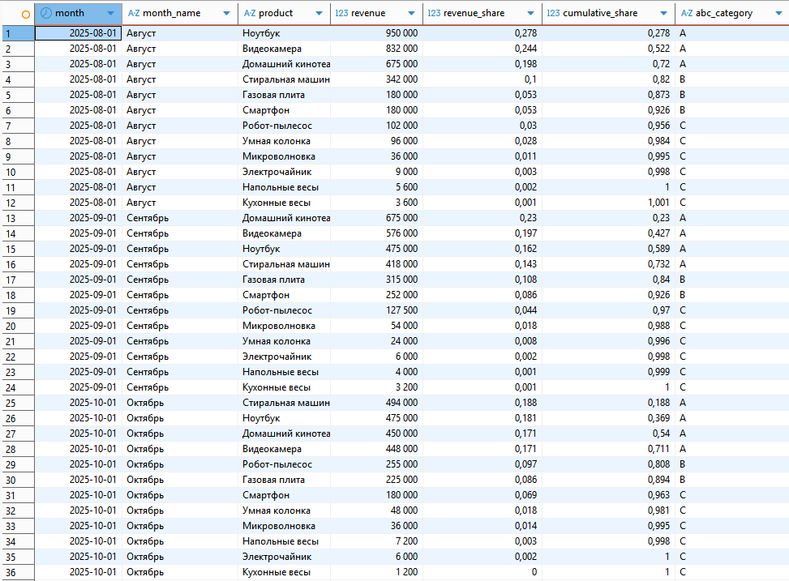
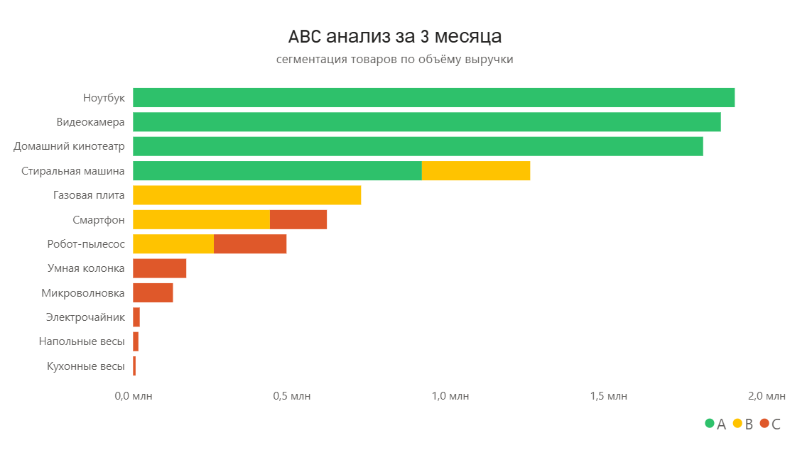

## Рейтинг Топ-3 товаров

###💎 Аналитические выводы
    #### 📈 В визуализации топ 3 использую ленточную диаграмму. 

Сразу видим, Домашний кинотеатр и Ноутбук не покидают тройку лидеров, хотя объём выручки у них вариируется от месяца к месяцу.
Ноутбуки активно раскупали перед началом учебного года.
Так же можем заметить сезонность в продажах Видеокамеры - в сезон отпусков их хорошо покупают, а вот в октябре их актуальность резко снижается, на первое место выходит Стиральная машина.

Конечно, проводя аналитику по выручке, мы увидим в топе товары, у которых выше цена. Даже если по количеству проданных товаров лидируют кухонные весы, они не попадут в рейтинг по выручке.

## ABC-анализ товарного ассортимента  

### 💎 Аналитические выводы
    #### 📈 В визуализации ABC анализа использую линейчатую диаграмму с накоплением.
    Условные обозначения для категорий ABC интуитивно понятны в традиционном светофорном стиле.
    Горизонтальное размещение позволяет комфортно прочесть наименования товаров.
    В предложенном графике отображаются данные сразу за все 3 месяца.

На диаграмме сразу заметно, что Ноубук, Видеокамера и Домашний кинотеатр не покидают категорию А 
и стабильно входят в число товаров, которые приносят 80% прибыли.
Как правило, такие товары не нуждаются в проведении специальных акций и больших скидках, но необходимо
поддерживать складские запасы и вовремя закупать товары с высоким спросом, чтоб не терять прибыль, если 
такой товар закончится.

В то же время, Умная колонка, Микроволновка, Электрочайник, Напольные весы, Кухонные весы стабильно остаются в категории С, принося совокупно меньше 5% выручки. Возможно, после более детальной аналитики, некоторые товары из этого списка целесообразно будет вывести из ассортимента, распродав остатки.

Маркетинговые усилия как правило рекомендуют сосредоточить на товарах из категрии В, тем более, в нашем случае, эта категория самая нестабильная - некоторые товары колеблются между А и В, В и С. Приложив дополнительные усилия для их продвижения, учитывая сезонность, праздники и возможность снижения цены, можем повысить их продажи.

Для более точного понимания, какие товары нужно дополнительно продвигать и продавать со скидками, необходимо так же провести ABC анализ по прибыли и количеству проданных товаров и другую анатилику, так как сегментация по выручке недает полной картины.